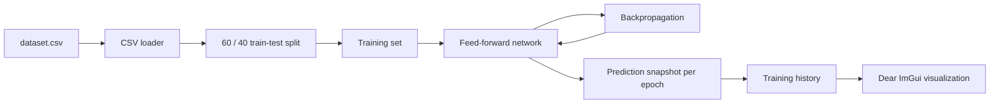

# Nonlinear Perceptron

<p align="center">
  <strong>A from-scratch C++20 neural network for nonlinear regression, with epoch-by-epoch visualization of how the model learns a function.</strong>
</p>

<p align="center">
  
  
  
  
</p>

<p align="center">
  
</p>

## Overview

**Nonlinear Perceptron** is a small neural network and visualization project written in C++ without TensorFlow, PyTorch, or any other ML framework.

The application trains a feed-forward network to approximate a noisy nonlinear function. During training, it stores the loss and the model prediction for every epoch. The GUI then lets you replay the learning process and inspect how the fitted curve evolves from an untrained network into a nonlinear approximation of the dataset.

The project is primarily educational, but its focus is implementation rather than wrapping an existing ML library: dense layers, activation, forward propagation, backpropagation, parameter updates, dataset handling, and training history are implemented directly in C++.

## Highlights

- Feed-forward neural network implemented from scratch
- Modular `Layer` interface with `Dense` and `Tanh` layers
- Manual forward propagation and backpropagation
- Mean Squared Error for nonlinear regression
- Immediate gradient-descent updates for every training sample
- Early stopping when the loss stops changing significantly
- Deterministic train/test split
- Per-epoch loss and prediction snapshots
- Interactive replay of the complete training trajectory
- Pan and zoom support in the visualization canvas
- C++20, CMake, OpenGL, GLFW, GLAD, and Dear ImGui

## How it works



For each training sample, the trainer performs a forward pass, calculates the prediction error, propagates the gradient backwards through the network, and immediately updates the weights and biases.

At the end of every epoch, the current model is evaluated on a fixed range of `x` values. These predictions are stored together with the epoch loss and later used by the GUI for playback.

> Training is completed before the GUI starts. The visualization replays recorded epoch snapshots rather than training the network in the render loop.

## Network architecture

The default application configuration uses a small multilayer perceptron:

```text
x
│
▼
Dense(1 → 5)
│
▼
Tanh
│
▼
Dense(5 → 1)
│
▼
ŷ
```

In code, the network is assembled as a stack of polymorphic layers:

```cpp
Network net;

net.add_layer(std::make_unique<Dense>(1, state.neurons_count));
net.add_layer(std::make_unique<Tanh>());
net.add_layer(std::make_unique<Dense>(state.neurons_count, 1));
```

`Network::forward()` passes data through the layers in order, while `Network::backward()` traverses the same stack in reverse and propagates gradients towards the input.

The layer-based design makes the network structure easy to extend with additional layer types or a different sequence of existing layers.

## Dataset

The bundled Python script generates one-dimensional nonlinear regression data using a noisy trend-plus-sine function:

```math
y = ax + \sin(\omega x + \varphi) + \varepsilon
```

where the slope, frequency, and phase are generated automatically and Gaussian noise is added to the target values.

The CSV format is intentionally simple:

```csv
x,y
-5.0,-2.17
-4.95,-2.08
...
```

The application loads `scripts/dataset.csv` and splits it into:

- **60% training data**
- **40% test data**

The split is shuffled with a fixed seed (`42`), making the train/test partition reproducible.

### Generate a new dataset

The generator requires Python with NumPy and Matplotlib:

```bash
python -m pip install numpy matplotlib
```

Run the script from the `scripts` directory so the generated file is placed where the application expects it:

```bash
cd scripts
python generate_dataset.py
cd ..
```

A new `scripts/dataset.csv` will be generated and the dataset will also be displayed as a scatter plot.

## Training process

The training loop is deliberately explicit:

```text
for each epoch
    for each training sample
        forward pass
        calculate prediction error
        accumulate squared error
        calculate output gradient
        backpropagate gradient
        update weights and biases

    store prediction curve
    store mean epoch loss
    check early-stopping condition
```

For a prediction `ŷ` and target `y`, the output gradient starts with:

```math
\frac{\partial}{\partial \hat{y}}(\hat{y} - y)^2 = 2(\hat{y} - y)
```

The gradient is then propagated through the output dense layer, the `tanh` activation, and the hidden dense layer.

The trainer also records a prediction curve after every epoch. By default, the curve consists of **200 samples** over the interval `[-6, 6]`.

Training stops when the loss change remains negligible for **30 consecutive epochs**, or when the configured epoch limit is reached.

## Visualization

The Dear ImGui interface displays:

- training samples
- test samples
- the model prediction curve for the selected epoch
- current epoch
- current loss
- playback speed

The colors distinguish the two dataset partitions, while the white curve shows the network output at the currently selected point in training history.

| Control | Action |
|---|---|
| `Play / Pause` | Start or pause epoch playback |
| `Reset` | Return to epoch `0` |
| `Epochs` | Manually inspect any recorded epoch |
| `Speed` | Set playback speed from `1` to `40` epochs per second |
| Left mouse drag | Pan the visualization |
| Mouse wheel | Zoom the visualization |

The main purpose of the UI is not only to show the final approximation, but to make the optimization process observable.

## Default configuration

| Parameter | Value |
|---|---:|
| Hidden neurons | `5` |
| Learning rate | `0.008` |
| Maximum epochs | `6000` |
| Train/test split | `60 / 40` |
| Prediction samples per epoch | `200` |
| Prediction range | `[-6, 6]` |
| Early-stopping patience | `30` epochs |
| Playback speed | `30` epochs/s |

The current values are defined in `app/gui/appstate.h`.

## Project structure

```text
.
├── app
│   ├── core
│   │   ├── data
│   │   │   ├── dataset.cpp
│   │   │   ├── dataset.h
│   │   │   └── sample.h
│   │   ├── network
│   │   │   ├── dense.cpp
│   │   │   ├── dense.h
│   │   │   ├── layer.h
│   │   │   ├── network.cpp
│   │   │   ├── network.h
│   │   │   ├── tanh.cpp
│   │   │   └── tanh.h
│   │   ├── trainer.cpp
│   │   └── trainer.h
│   ├── gui
│   │   ├── appstate.h
│   │   ├── gui_manager.cpp
│   │   └── gui_manager.h
│   └── main.cpp
├── images
│   └── demo.png
├── lib
│   ├── glad
│   └── imgui
├── scripts
│   ├── dataset.csv
│   └── generate_dataset.py
└── CMakeLists.txt
```

The project is split into two main parts:

- `core` — dataset loading, neural-network layers, network execution, and training
- `gui` — OpenGL/GLFW initialization, application state, and Dear ImGui visualization

## Build and run

### Requirements

- CMake `3.16+`
- A C++20 compiler with GCC/Clang-style compiler options
- Git and an internet connection during the first CMake configure step
- OpenGL support

Dear ImGui and GLAD are vendored in the repository. GLFW `3.3.9` is fetched by CMake through `FetchContent`.

### Build

From the repository root:

```bash
cmake -S . -B build -DCMAKE_BUILD_TYPE=Release
cmake --build build --parallel
```

### Run

Launch the executable **from the repository root** because the application reads `scripts/dataset.csv` using a relative path:

```bash
./build/nonlinear-perceptron
```

For multi-config generators, the executable may be placed in a configuration-specific directory such as:

```bash
./build/Release/nonlinear-perceptron
```

On Windows, use the corresponding `.exe` path produced by your CMake generator.

## Project scope

This project is intentionally focused on **one-dimensional nonlinear regression and training visualization**. It is not intended to be a general-purpose deep-learning framework.

The goal is to keep the learning mechanics visible in the source code: the model architecture, matrix-like dense-layer operations, activation derivative, gradient propagation, parameter updates, early stopping, and visualization history can all be followed directly without stepping through a large ML runtime.