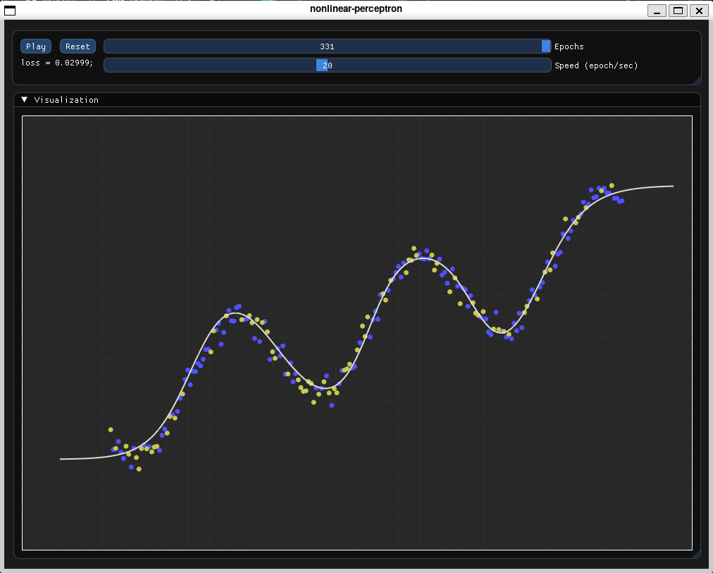

# nonlinear regression perceptron (C++)

A small experimental project that implements a simple feedforward neural
network from scratch in **C++** and visualizes the **training process
for a regression task**.

The goal of the project is educational: to demonstrate how a neural
network learns to approximate a function (for example, a sine wave) and
to visually observe the training dynamics.

The visualization is implemented using **Dear ImGui**, and the neural
network itself is written without external ML libraries.

------------------------------------------------------------------------

# Features

-   Implementation of a **fully connected neural network** from scratch
-   Support for multiple layers
-   **tanh activation**
-   **Mean Squared Error (MSE)** loss
-   Gradient descent training
-   Tracking and storing training history
-   Interactive **training visualization**
-   Zoom and pan of the coordinate system
-   Playback of training iterations

------------------------------------------------------------------------

# Architecture

### The neural network is implemented as a stack of layers:

Input\
↓\
Dense\
↓\
Tanh\
↓\
Dense\
↓\
Output

### Example configuration:

Dense(1 → 32)\
Tanh\
Dense(32 → 16)\
Tanh\
Dense(16 → 1)

The network approximates a continuous function from a generated dataset.

------------------------------------------------------------------------

# Dataset

The dataset is generated using a Python script.

Example function:

y = sin(x) + noise

To generate a dataset:

    python scripts/generate_dataset.py

This creates:
-   `dataset.csv`

Each file contains:

    x,y

------------------------------------------------------------------------

# Visualization

The project uses **Dear ImGui** to visualize:

-   training samples
-   test samples
-   current model prediction
-   training progress over iterations

Controls:

Control            Description
  ------------------ ---------------------------------
Play / Pause       Start or stop training playback
Reset              Reset and drag to default
Epochs slider      Move through training steps
Speed              Control playback speed
Mouse drag         Move canvas
Mouse wheel        Zoom

------------------------------------------------------------------------

# Training Process

During training the following data is recorded:

-   **Loss per epoch**
-   **Predict values per epoch**

This allows replaying the entire training process visually.
Stopping criterion used in the trainer:
training stops when loss stops decreasing

------------------------------------------------------------------------

# Dependencies

The project uses the following libraries:

-   **C++20**
-   **OpenGL**
-   **GLFW**
-   **GLAD**
-   **Dear ImGui**
-   **OpenMP**

------------------------------------------------------------------------

# Build

Example using CMake:

    mkdir build
    cmake -S . -B build
    cmake --build build

Run:

    ./build/nonlinear-perceptron